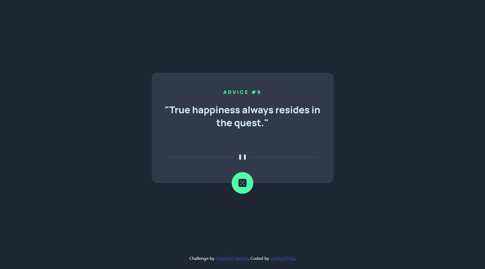
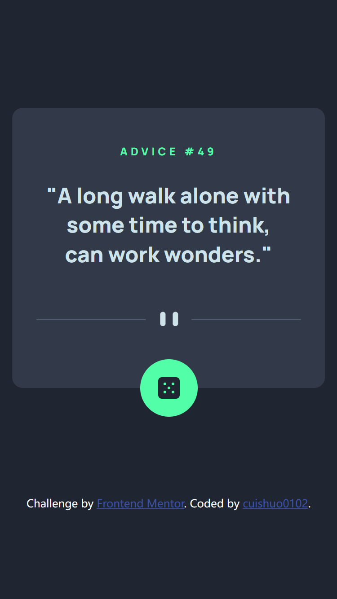

# Frontend Mentor - Advice generator app solution

This is a solution to the [Advice generator app challenge on Frontend Mentor](https://www.frontendmentor.io/challenges/advice-generator-app-QdUG-13db). Frontend Mentor challenges help you improve your coding skills by building realistic projects.

## Table of contents

- [Overview](#overview)
  - [The challenge](#the-challenge)
  - [Screenshot](#screenshot)
  - [Links](#links)
- [My process](#my-process)
  - [Built with](#built-with)
  - [What I learned](#what-i-learned)
  - [Continued development](#continued-development)
- [Author](#author)

**Note: Delete this note and update the table of contents based on what sections you keep.**

## Overview

### The challenge

Users should be able to:

- View the optimal layout for the app depending on their device's screen size
- See hover states for all interactive elements on the page
- Generate a new piece of advice by clicking the dice icon

### Screenshot



### Links

- Solution URL: [GitHub](https://github.com/cuishuo0102/advice-generator-app)
- Live Site URL: [GitHub Pages](https://cuishuo0102.github.io/advice-generator-app)

## My process

### Built with

- CSS custom properties

### What I learned

To change the loaded img base on media query, the most easy way is to use the picture element in HTML 5
```html
<picture class="divider">
  <source srcset="./images/pattern-divider-desktop.svg" media="(min-width: 1024px)">
  
</picture>
```

### Continued development
- implement with Vue.js 2
- implement with Vue.js 3
- implement with React
- implement with Angular

### Useful resources

- [Loading an image based on browser width](https://stackoverflow.com/questions/45274451) - This helped me with the method to load different images fitted to screen base on media query. The answers introduce the easiest way and alternatives. I really think this is a good post.

## Author

- Website - [cuishuo0102](https://github.com/cuishuo0102)
- Frontend Mentor - [@cuishuo0102](https://www.frontendmentor.io/profile/cuishuo0102)
